# Unified Remote Integration for HASS
> This is an Home Assistant integration that allows you control your computer by using [Unified Remote](https://www.unifiedremote.com/)

[](License)


<p align="center">
  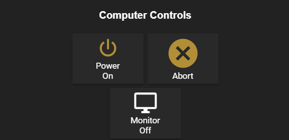
</p>

## Documentation guide

- [Unified Remote Integration for HASS](#unified-remote-integration-for-hass)
  - [Documentation guide](#documentation-guide)
  - [Installation](#installation)
    - [Unified Remote](#unified-remote)
      - [Management Panel](#management-panel)
      - [Setting up](#setting-up)
    - [Home Assistant](#home-assistant)
      - [CONFIGURATION VARIABLES (For unified_remote)](#configuration-variables-for-unified_remote)
      - [CONFIGURATION VARIABLES (For each host)](#configuration-variables-for-each-host)
  - [Getting Started](#getting-started)
    - [How it works](#how-it-works)
      - [Remote description](#remote-description)
      - [Finding remote information](#finding-remote-information)
    - [Remotes file](#remotes-file)
      - [Remotes section](#remotes-section)
      - [Types section](#types-section)
  - [How to use](#how-to-use)
    - [Examples](#examples)
  - [Contribute](#contribute)
  - [Submit Feedback](#submit-feedback)


## Installation

### Unified Remote

Just download [Unified Remote server](https://www.unifiedremote.com/download) for your computer and follow the installation steps provided on Unified Remote web page.

**If you use windows, make sure to allow "Windows service (Experimental)" option on installation.**

<p align="center">
  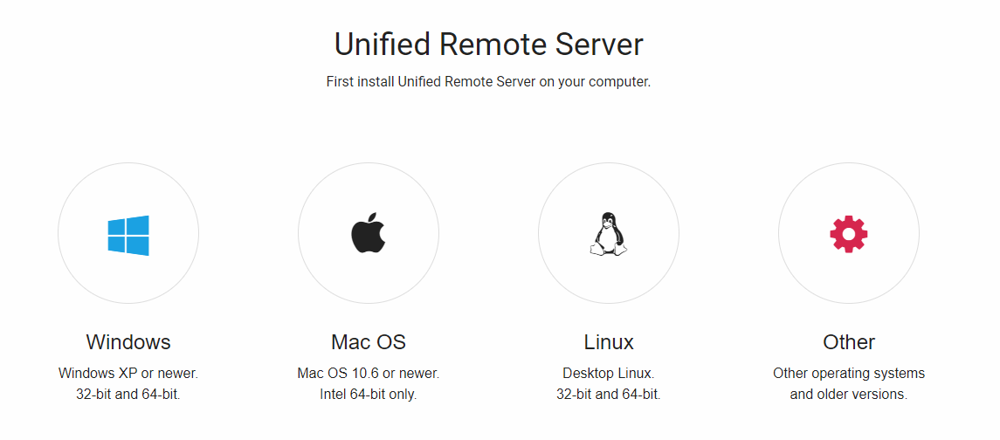
</p>

#### Management Panel

After installation, click with right mouse button on icon and go to management panel by click "Manage" (on windows)

<p align="center">
  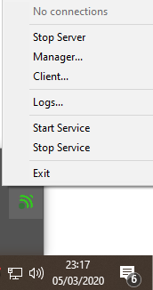
</p>

If you're not using Windows, you can access the management panel just by accessing this address http://localhost:9510/web/, that is general access form that works with any OS.

The management panel should look like this:

<p align="center">
  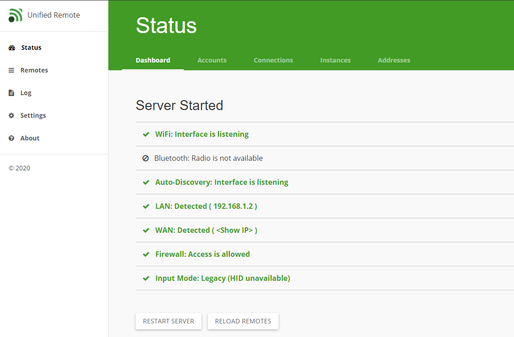
</p>

#### Setting up

Now we are going to set some options to make this integration works without more problems.

- In the left corner, click on *Settings* section, and on the top bar, click on *Network* section. 

- Now make sure that "*Enable web-based client (http://localhost:9510/client)*" box is allowed.

- For security reasons, you also should disallow "*Allow management from a different LAN computer*" option.


<p align="center">
  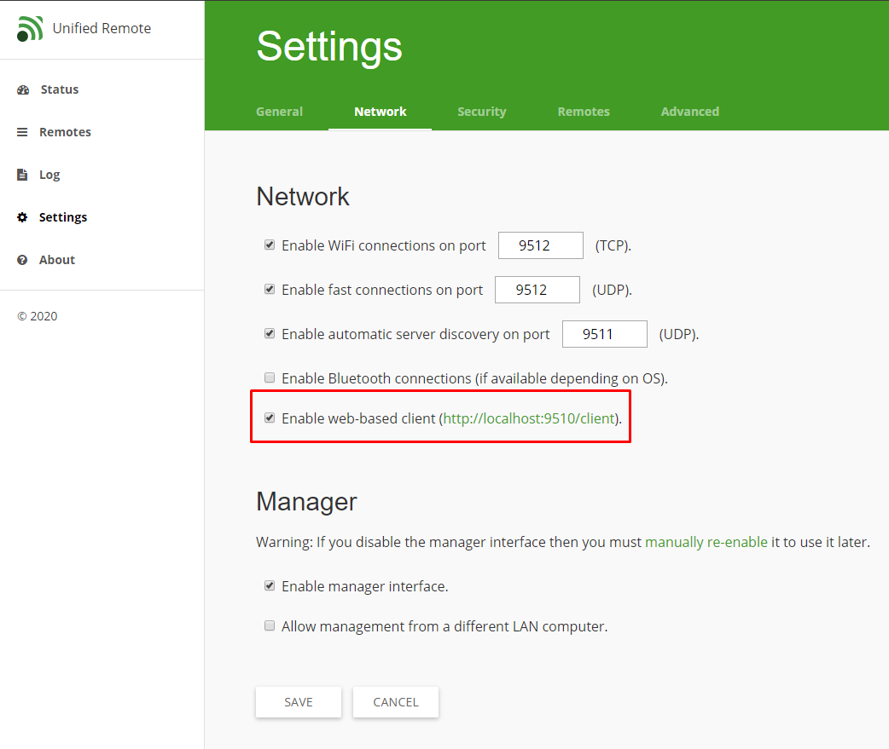
</p>

Next section will be **Security**, on this one you must change *Authetication* to "*Do not require apps to enter a password before connecting.*"


<p align="center">
  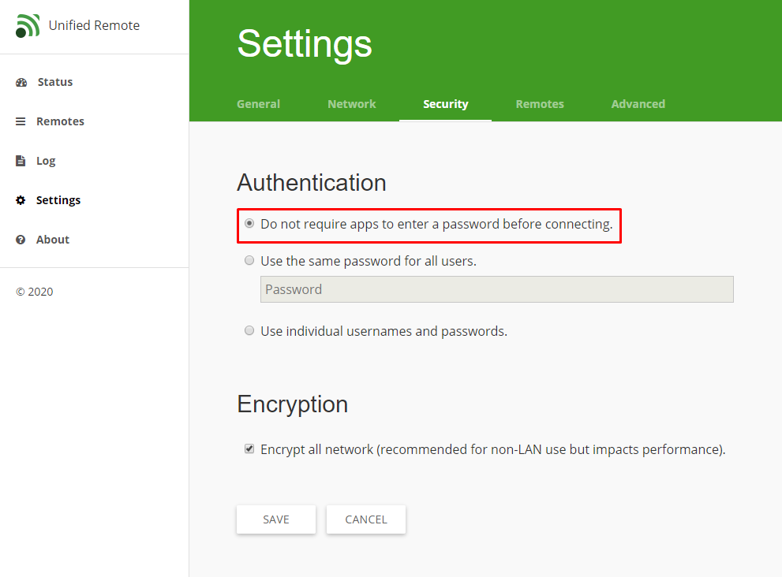
</p>

> **The integration **WON'T WORK** if you set a password, but don't worry, to secure the installation, you can set your firewall to only receive connections on 9510-9512 port range that comes from your Home Assistant local IP (and your local computer IP, of course).**

Now, if you're using Windows, click on "*Advanced*" tab, and make sure that **Enable driver on Windows.** box is enabled.

### Home Assistant

First clone this repository by following command
    
    git clone https://github.com/DaviPtrs/hass-unified-remote.git

Copy **`custom_componentes/unified_remote`** bin to **`<home-assistant-config-path>/custom_components`**

On your `configuration.yaml` file, add the following lines:

```yaml
unified_remote:
  hosts:
    - host: UNIFIED_REMOTE_SERVER_IP
```

#### CONFIGURATION VARIABLES (For unified_remote)

**hosts**

*(list)(Required)*

List of hosts

============================================

**retry_delay**

*(number)(Optional)*

Time to retry connection and/or keep it alive (seconds). You **CANNOT** set a delay greater than 120 seconds, this is the max value that will keep the connection alive.

*Default value:*

retry_delay: 120

#### CONFIGURATION VARIABLES (For each host)
**host**

*(string)(Required)*

Unified Remote server IP a.k.a. your computer local IP

============================================

**port**

*(number)(Optional)*

Unified Remote web client port.

*Default value:*

port: 9510

============================================

**name**

*(string)(Optional)*

A name to identify the host. If unset, the name will be the host ip.

*Default value:*

name: \<host ip\>

## Getting Started

### How it works

In the Unified Remote pack, we got a server that receive commands and execute them in your computer. These commands are called by *Remotes*.

We also got a web based client, that can send remotes without any paid mobile app.

The *Unified Remote Integration for Home Assistant* just send requests to that web-based client, with a remote parameters, to make the action happen.

#### Remote description

Every remote contains 2 fields, Remote ID and Remote Action.

Example: 

- If you want to turn off your computer, you need to use this remote
```
id: Unified.Power
action: turn_off
```

- If you want to open netflix on your browser, you need to use this one
```
id: Unified.NetflixWeb
action: launch
```

#### Finding remote information

To find these required information about some remote: 
- First open the web client on http://localhost:9510/client/ (if you wanna do this in another computer, just replace "localhost" by your target computer IP)

<p align="center">
  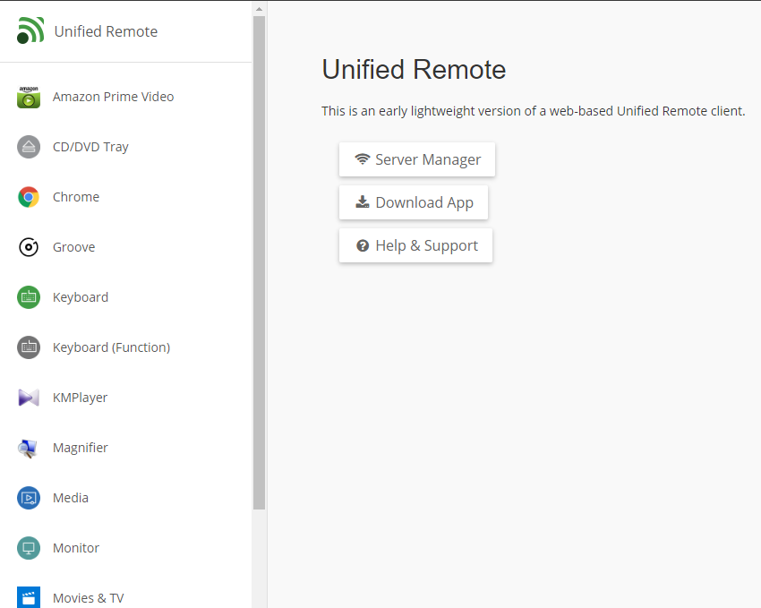
</p>

- Choose your desired remote on the left menu, for this example we'll be using *Spotify* Remote
- After choose, you will see, on URL, the remote ID. In our example: `Unified.Spotify`

<p align="center">
  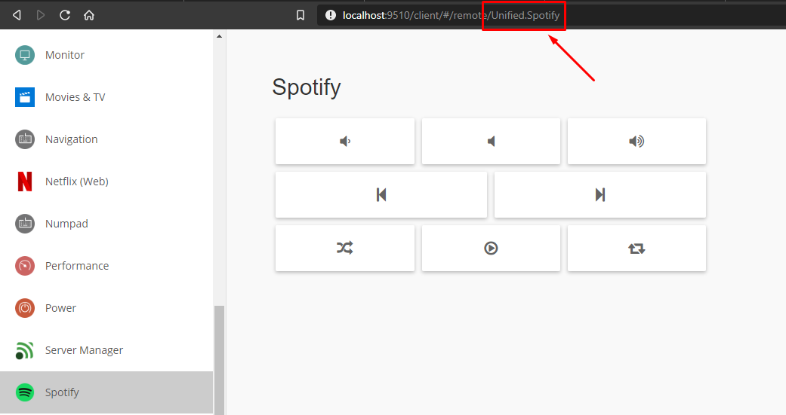
</p>

- To get the action name, open the browser network monitor (usually you have to press `F12` and click on `Network` tab)

<p align="center">
  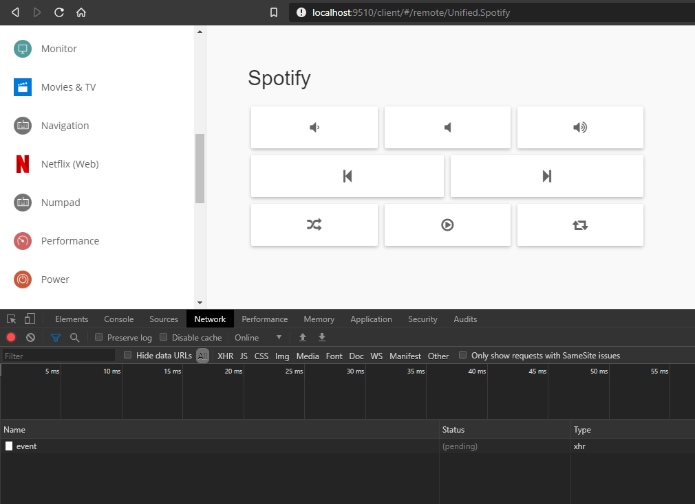
</p>

- Then, click on desired action button, for this example, we'll click on `Play` button
- After that, a "request" element will be displayed, that is our action request

<p align="center">
  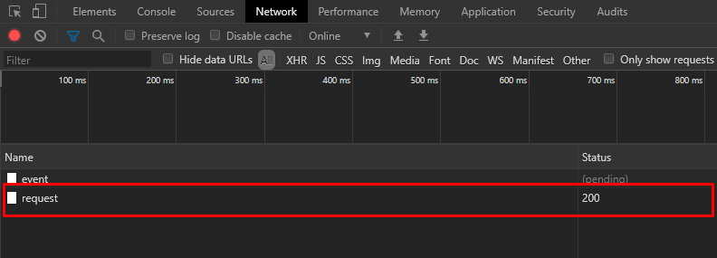
</p>

- Click on it, and you will get something like this

<p align="center">
  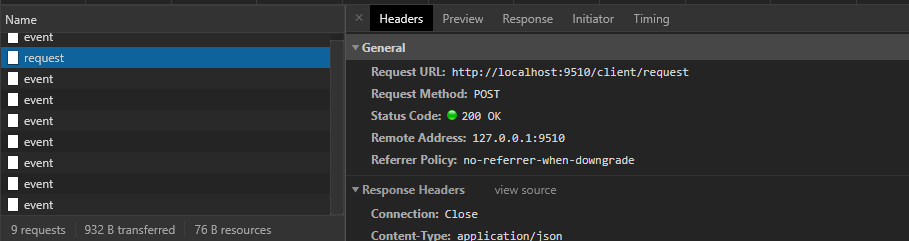
</p>

- Scroll down on headers section until you find a "Form data" sub-section, here we got a JSON, and in `Name`, there's a string. That was our desired action name.

<p align="center">
  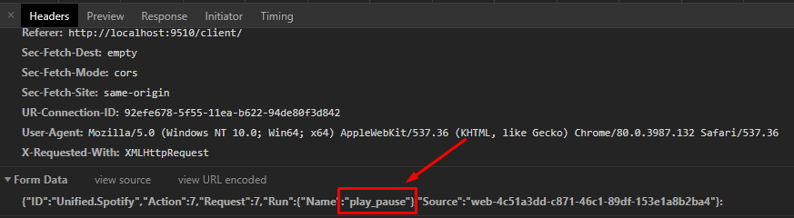
</p>

So we finaly got all required information to use Spotify Remote to play/pause our songs:
```
remote_id: Unified.Spotify
action: play_pause
```

In the next section, we'll be able to declare your remotes, assign them a friendly name and declare all possible actions

### Remotes file

In *`unified_remote/cli`* folder, there's a file called *`remotes.yml`* 

Which comes by default with following entries, that we're gonna explain each section

```yaml
remotes:
  prime_video:
    id: "Unified.AmazonPrimeVideo"
    type: media_video
  monitor:
    id: Unified.Monitor
    type: monitor
  power:
    id: Unified.Power
    type: power
  netflix:
    id: Unified.NetflixWeb
    type: media_video
    controls:
      - "window"
      - "skip_intro"
types:
  media:
    controls:
      - "volume_down"
      - "volume_mute"
      - "volume_up"
      - "previous"
      - "next"
      - "stop"
      - "play_pause"
  media_video:
    controls:
      - "volume_down"
      - "volume_mute"
      - "volume_up"
      - "play_pause"
      - "launch"
      - "fullscreen"
      - "rewind"
      - "forward"
  monitor:
    controls:
      - "turn_on"
      - "turn_off"
      - "standby"
      - "internal" # Computer only mode
      - "external" # Projector only mode
  power:
    controls:
      - "logoff"
      - "lock"
      - "abort"
      - "restart"
      - "shutdown"
      - "hibernate"
      - "sleep"
```

#### Remotes section

This section describe every remote you want to execute, instead of always remeber the Remote ID, you can declare it with whatever name you want.

**Every remote *MUST* contain or `type` or `controls` (inclusive OR), besides having a `id`, of course.**

```yaml
remotes:
  power:
    id: Unified.Power
    type: power
  netflix:
    id: Unified.NetflixWeb
    type: media_video
    controls:
      - "window"
      - "skip_intro"
```


**id**

*(String)(Required)*

Remote ID explained previously.

Example: 
```yaml 
id: Unified.Monitor
```

**controls**

*(String array)(Required)*

A list(array) of action that can be performed by that remote.

Example: 
```yaml 
controls: 
  - "turn_off"
  - "turn_on"
```

**type**

*(String array)(Required)*

In this parameter, you can use what we called of "Action list", for those remotes that share commons actions, like remotes that have `turn_off` and `turn_on`. In the next section we going to explain how to declare an action list.

Example: 
```yaml 
type: media_video
```

#### Types section

This section allows you to declare an action list, so you don't need to write common actions for every remote, even if they are from the same category (like media players, streaming platforms).

```yaml
types:
  media_video:
    controls:
      - "volume_down"
      - "volume_mute"
      - "volume_up"
      - "play_pause"
      - "launch"
      - "fullscreen"
      - "rewind"
      - "forward"
  power:
    controls:
      - "logoff"
      - "lock"
      - "abort"
      - "restart"
      - "shutdown"
      - "hibernate"
      - "sleep"
```

In that example, 2 types was declared, one for Remotes that controls programs like Netflix, Prime Video, Stremio and etc, and one for any Remote that controls the power supply of any device (Your computer, for example).

So like that, every Remote of `media_video` type, contains all actions from it type.

For example, instead of do this:

```yaml
remotes:
  prime_video:
    id: "Unified.AmazonPrimeVideo"
    controls:
      - "volume_down"
      - "volume_mute"
      - "volume_up"
      - "play_pause"
      - "launch"
      - "fullscreen"
      - "rewind"
      - "forward"
  netflix:
    id: Unified.NetflixWeb
    controls:
      - "volume_down"
      - "volume_mute"
      - "volume_up"
      - "play_pause"
      - "launch"
      - "fullscreen"
      - "rewind"
      - "forward"
      - "window"
      - "skip_intro"
```

We can do just like that:

```yaml
remotes:
  prime_video:
    id: "Unified.AmazonPrimeVideo"
    type: media_video
  netflix:
    id: Unified.NetflixWeb
    type: media_video
    controls:
      - "window"
      - "skip_intro"
types:
  media_video:
    controls:
      - "volume_down"
      - "volume_mute"
      - "volume_up"
      - "play_pause"
      - "launch"
      - "fullscreen"
      - "rewind"
      - "forward"
```

With the previous cases, we just declared 2 media_video remotes, but think if we want to add 5 remotes like the first example, it will become a mess...

> For now, is NOT allowed to add more then one type for each remote, but we will working on it soon as possible.

## How to use

Now we got a configured integration and declarated remotes, we have to be able to execute these action using remotes, of course, inside of Home Assistant.

This integration actualy register a service, called by `unified_remote.call`

That service allows you to call your remotes.

> Unfortunally Unified Remote doesn't return any type of errors if you call an inexistent remote, so the only way to know if something goes wrong is if you make sure that HASS is connected with Unified Remote client, but nothing happens when you call your remote. 

> If you are sure about remote info but nothing happens, it can be a bug with Unified Remote, in that case, just restart the server of your computer.

- Just call the service with following service_data

```yaml
remote: remote_name (NOT THE REMOTE ID)
action: remote_action
```

- You also can call remote that was not declared on devices.yml, like that:
  
```yaml
remote_id: remote_id
action: remote_action
```

- To specify which computer will receive the command, just add a `target` entry:

```yaml
target: computer_name
remote_id: remote_id
action: remote_action
```

- You can also specify Extras entry for those remotes that requires it:

```yaml
remote_id: remote_id
action: remote_action
extras:
  Values:
    - Value: value1
```

### Examples

This call will open Amazon Prime Video on my default browser.

```yaml
remote: prime_video
action: launch
```

That will do the same, but without declare it first.

```yaml
remote_id: Unified.AmazonPrimeVideo
action: launch
```

The same but specifying a computer by name:

```yaml
target: PcMasterRace
remote_id: Unified.AmazonPrimeVideo
action: launch
```

If you didn't assign a computer name, the name will be same as computer ip, so:

```yaml
target: 192.168.1.2
remote_id: Unified.AmazonPrimeVideo
action: launch
```

This is an example using a remote that requires Extras entries. In this case, it will press down or press up the Win key.

```yaml
remote_id: Relmtech.Keyboard
action: toggle
extras:
  Values:
    - Value: LWIN
```

- For adding buttons on your home assistant lovelace, use `Manual Card` element with `call-service` action, like:

```yaml
type: 'custom:button-card'
entity: ""
confirmation:
  text: '[[[ return `Are you sure you want turn computer power?` ]]]'
tap_action:
  action: call-service
  service: unified_remote.call
  service_data:
    action: restart
    remote: power
icon: 'mdi:power'
name: Restart
show_icon: true
show_state: true
```

That example will restart my computer if I tap the button, after I accept the confirmation pop-up.

<p align="center">
  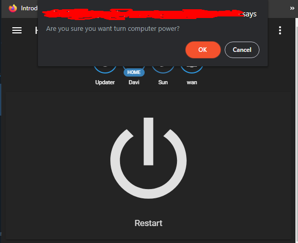
</p>

## Contribute

Contributions are always welcome!
If you need some light, read some of the following guides: 
- [The beginner's guide to contributing to a GitHub project](https://akrabat.com/the-beginners-guide-to-contributing-to-a-github-project/)
- [First Contributions](https://github.com/firstcontributions/first-contributions)
- [How to contribute to open source](https://github.com/freeCodeCamp/how-to-contribute-to-open-source)
- [How to contribute to a project on Github](https://gist.github.com/MarcDiethelm/7303312)

## Submit Feedback

Be free to [open an issue](https://github.com/DaviPtrs/hass-unified-remote/issues/new/choose) telling your experience, suggesting new features or asking questions (there's no stupid questions, but make sure that yours cannot be answered by just reading the docs)

You can also find me on LinkedIn [/in/davipetris](https://www.linkedin.com/in/davipetris/)
